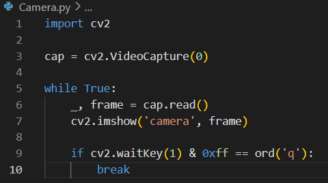
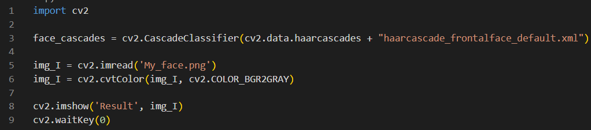
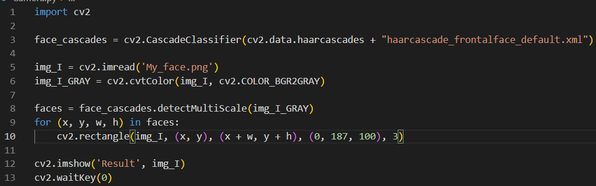
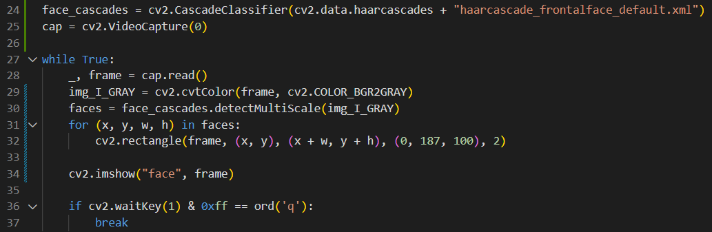

# Описание команд файла Camera.py
*в этом файле мы написали код, который связывается с нашей камерой, показывает изображение и определяет лицо*

1. import cv2 # *подключает библиотеку cv2*
2. cap = cv2.VideoCapture(0)# *вызвали библиотеку cv2 и метод VideoCapture, который связывается с камерой или видио. Если в скобках указывать цифру, то она будет указывать на опрделённую камеру, в зависимости сколько их подключено к компу. Если указать 0, то это означает, что первую камеру, ну или единственную*
3. while True: #*запускает бесконечный цикл*
4. _, frame = cap.read() #*обращается к переменной cap, считывает что там есть и записывает в переменную Frame*
5. cv2.imshow('camera', frame) #*выводим на экран в окне, которое назвали "camera", нашу картинку*
6. if cv2.waitKey(1) & 0xff == ord('q'): # *мы выводим на экран картинку на (1) миллисекунду, затем цикл повторяется и выводит уже другой кадр и так каждую 1 миллисекунду. Значение в скобках можно менять. Так как мы работаем с бесконечным циклом, то наше окно нужно будет как-то закрыть, то есть прервать бесконечный цикл. Для этого пишем **0xff == ord('q')**, что означает, если мы нажмём **q**, то цикл закроется после команды break*
## Вот этот кусочек кода, который просто выводит камеру

* В библиотеке **cv2** уже сцществуют данные, которые могут определить лицо(такие нейросети). Нужно просто уметь это всё подключить. [Классификаторы для распознавания](https://github.com/opencv/opencv/tree/4.x/data/haarcascades)

1. face_cascades = cv2.CascadeClassifier(cv2.data.haarcascades + "haarcascade_frontalface_default.xml") # *обращаемся к библиотеке через **cv2**; **CascadeClassifier** - загружаем классификатор, то есть на основании чего мы будем делать какой-то анализ; А в скобках указываем, что мы собираемся найти на изображении; А в скобках мы указываем путь к файлам и указываем название файла того, что мы будем определять на изображении.* ***Напомню, что в библиотеке cv2 уже всё это загруженно. Ссылка дана для того, что бы можно было выбрать мне что я  хочу на изображении найти***
2. Далее я сразу попробую определить лицо с картинки. Я загрузил картинку со своим лицом и конвертирую это изображение в изображение с серыми оттенками. Это делается для того, что бы программе было проще и быстрее определять лицо.
* img_I_GRAY = cv2.cvtColor(img_I, cv2.COLOR_BGR2GRAY) 
    * cv2.cvtColor - обращаемся к библиотеке и вызываем метод, который меняет цвет изображения. 
    * (img_I, cv2.COLOR_BGR2GRAY) - указывается что во что конкретно нужно перевести изображение. Из BGR в GRAY(серый).
    * 
* faces = face_cascades.detectMultiScale(img_I_GRAY)
    * detectMultiScale - метод, который считывает координаты места, где предполагаемо есть лицо.
    * если вывести на экран в консоли переменную faces, то увидим [380 426 133 133]. Это означает, что метод detectMultiScale определил координаты, где прндполагаемо есть лицо. Первые два числа это начало квадрата, а вторые два это длина и ширина.
* теперь нужно нарисовать этот квдрат на нашем изображении. Напишем цикл на потобии Foeach.
    * for (x, y, w, h) in faces:
    
         cv2.rectangle(img_I_GRAY, (x, y), (x + w, y + h), (255, 0, 0), 2)
         
         Метод будет проходить по всем (x, y, w, h) в faces. А метод **rectangle** Рисует квадрат. В скобках указываем на каком изображении и координаты. Далее в скобках указываем цвет квадрата по системе BRG. И крайняя цифра это толщина рамки.
    *
* Теперь склеиваем все знания и накладываем на видео.

24 строка - подключение "магии", которая определяет лицо

25 строка - в переменную подключает камеру

28 строка - в переменную считывает кадр с камеры

29 строка - переводит картинку в серые тона, что бы дальше было проще программе определять лицо

30 строка - определяет координаты лица

31, 32 строки - рисует квдрат вокруг лица.

34 строка - показывает изображение

36 строка - показывает, что на 1 миллисек. показывает изображение и закрывает, затем цикл повторяется. Из-за частоты получается видео. Если нажать 'q', то прога закроется.
